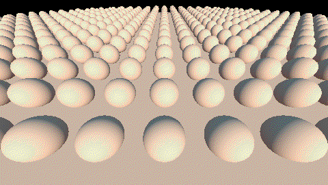

## Basic Example

### `main.go`
```go
package main

import (
	"math"
	"os"

	"github.com/husenap/gomarch/gomarch"
	"github.com/husenap/gomarch/gomarch/vec"
)

func mod(x, y float64) float64 {
	return x - y*math.Floor(x/y)
}

func pMod(p *float64, s float64) {
	halfSize := s * 0.5
	*p = mod((*p)+halfSize, s) - halfSize
}

func sdf(position vec.Vec3) float64 {
	pMod(&position.X, 3.0)
	pMod(&position.Z, 3.0)
	d := vec.Length(position) - 1.0
	d = math.Min(d, position.Y+1.0)
	return d
}

func cameraTick(t float64) (position, lookat vec.Vec3) {
	a := t * 2.0 * math.Pi
	position = vec.Scale(vec.New(math.Cos(a), 1.0, math.Sin(a)), 5.0)
	lookat = vec.Zero()
	return
}

func main() {
	resolutionScale := 0.25
	options := gomarch.Options{
		FrameCount: 60,
		DeltaTime:  1000.0 / 60.0,
		Width:      int(1920 * resolutionScale),
		Height:     int(1080 * resolutionScale),
		FOV:        0.9,

		SDF:        sdf,
		CameraTick: cameraTick,
	}

	gomarch.Render(options, os.Stdout)
}
```

### Run it
```bash
$ go run main.go > out.gif
```

### Result
